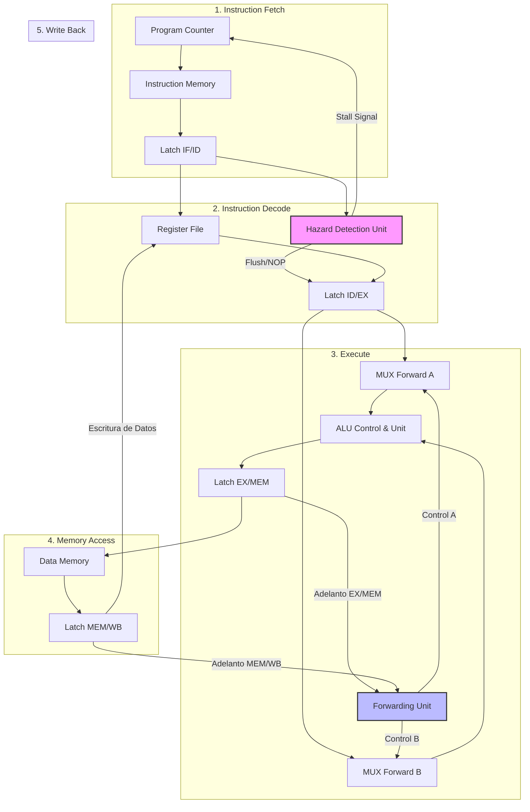
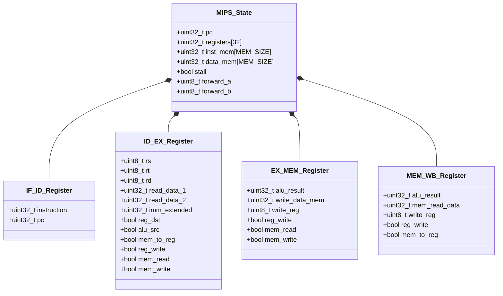

# Simulador MIPS de 5 Etapas en C

Simulador de un procesador MIPS con pipeline de 5 etapas (**IF, ID, EX, MEM, WB**), implementación de **Forwarding Unit** para resolución de Hazards de Datos y **Hazard Detection Unit** para puestos (stalls) por Load-Use.

---

## Requisitos
- Compilador de C (`gcc` recomendado).
- `make` (opcional).

---

## Compilación y Ejecución

### 1. Compilación manual con GCC
```bash
gcc -Wall -std=c99 main.c mips_sim.c -o mips_sim

```
### 2. Ejecutar Unit tests y system test
./mips_sim

### 3. Ejecutar un programa binario desde txt
./mips_sim program.txt


## Diagramas de Arquitectura y Pipeline

### 1. Flujo de Procesamiento y Unidades de Control
El siguiente diagrama describe el paso de datos a través de las 5 etapas del pipeline (`IF`, `ID`, `EX`, `MEM`, `WB`), registrando cómo la **Hazard Detection Unit** y la **Forwarding Unit** interceptan las señales.



---

### 2. Estructura de Registros Intermedios (`MIPS_State`)
Representación de las estructuras en C definidas para simular los latches interetapa del procesador:

